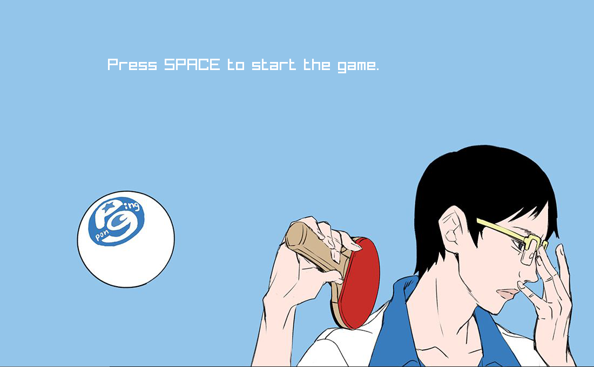
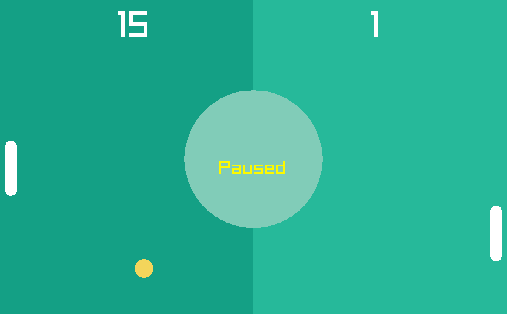

# Pong-CPP-OOP
The repo contains the implementation of the PONG game using Object Oriented Programming in C++. 
This project has been inspired by [Programming with Nick](https://www.youtube.com/watch?v=VLJlTaFvHo4) 
Some of the improvements I have made include: 
1. Object-Oriented Approach 

2. Starting Screeen 

3. pause Button(spacebar) 

4. Sound Effects 
